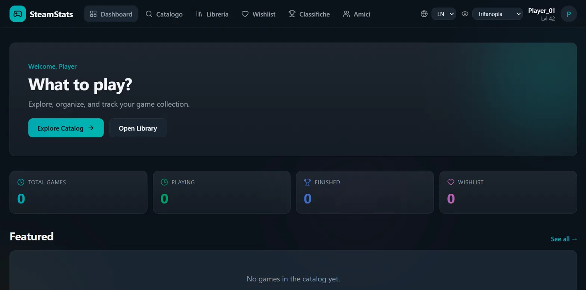
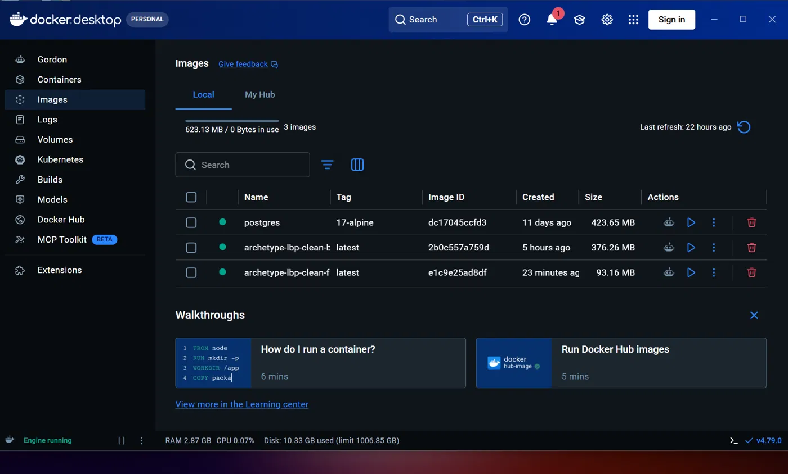

# Fix: riorganizzazione backend + Docker funzionante

> Branch: `fix/riorganizzazione-e-bugfix`

## Cosa risolve questo branch

Partendo da `main` (che non compilava e non partiva in Docker), questo
branch sistema backend, schema database e build del frontend, fino ad
avere l'intero stack (db + backend + frontend) funzionante insieme via
Docker Compose.

## Problemi trovati e risolti

### Backend
- Entity (`User`, `Game`, `Backlog`, ecc.) erano sparse alla radice del
  package, senza una cartella `model/` dedicata — spostate e import
  aggiornati ovunque
- `Game.developer` / `Game.publisher` / `Game.genres` erano stringhe
  semplici, ma lo schema SQL ha relazioni vere (`developer_id`,
  `publisher_id`, tabella ponte `game_genres`) — convertite in
  relazioni JPA vere (`@ManyToOne`, `@ManyToMany`), con pattern
  find-or-create per restare compatibili con l'API esistente
- Nomi colonna disallineati tra Java e SQL: `steam_app_id` → `appid`,
  `password_hash` → `password`
- L'entity `UserGame` puntava a una tabella `user_games` inesistente —
  è un doppione di `Backlog`, ora punta alla tabella `backlog`
- 6 test rotti per mock incompleti/nell'ordine sbagliato (non bug nel
  codice di produzione)

### Database
- Lo schema usava `SERIAL`/`INTEGER` per le chiavi, ma le entity Java
  dichiarano `Long` → aggiornato a `BIGSERIAL`/`BIGINT`

### Frontend
- Il progetto partiva da un template **Lovable.dev**, configurato di
  default per **Cloudflare Workers/edge** (TanStack Start + Nitro con
  SSR) — incompatibile con un container Nginx self-hosted
- Rimossi `@tanstack/react-start`, `nitro`, `@lovable.dev/vite-tanstack-config`
- Tenuto solo **TanStack Router** (compatibile con Vite normale),
  convertito a SPA statica
- File di traduzione (`en.json`, `fr.json`, `it.json`) e
  `package-lock.json` erano puntatori Git LFS rotti (la regola
  `.gitattributes` originale applicava LFS a *tutti* i `.json` del
  repo) — recuperato il contenuto vero, `.gitattributes` ristretto a
  `data/*` solo

### Pulizia repo
- Rimossi: `apache-maven-3.9.9/` e `git-lfs-3.7.1/` vendorizzati (si
  scaricano con un comando, non si versionano), dataset da 850MB+
  spostati in `data/` (escluso da Git)

## Come testare in locale

Prerequisiti: Docker Desktop (con integrazione WSL se su Windows).

```bash
git checkout fix/riorganizzazione-e-bugfix

# Mettere games.csv e games.json dentro data/ (non sono nel repo)

docker compose down -v
docker compose up --build db backend frontend
```

Poi:
- Frontend: http://localhost:3000
- Backend: http://localhost:8080/api/health (deve rispondere `{"status":"UP","database":"UP"}`)

Popolare il database (prima volta):
```bash
docker compose --profile init up populate
```

## Verificato

- `mvn clean test` → BUILD SUCCESS, 55/55 test passati
- `npm run build` (frontend) → build statica generata senza errori
- `docker compose up --build db backend frontend` → tutti e tre i
  servizi `Up`, backend e frontend raggiungibili e funzionanti

## Cosa NON è stato testato a fondo

- Non tutte le pagine del frontend sono state cliccate una per una in
  Docker — solo la homepage è stata verificata fino in fondo dopo il
  fix del bug `PagedResponse`. Possibili bug simili in altre pagine
  che fanno la stessa chiamata API non ancora controllate.

## Screenshot — prova che funziona davvero

**Dashboard del frontend, funzionante con dati reali, multilingua e colorblind mode attivi:**



**Docker Desktop con le immagini buildate (backend + frontend):**


